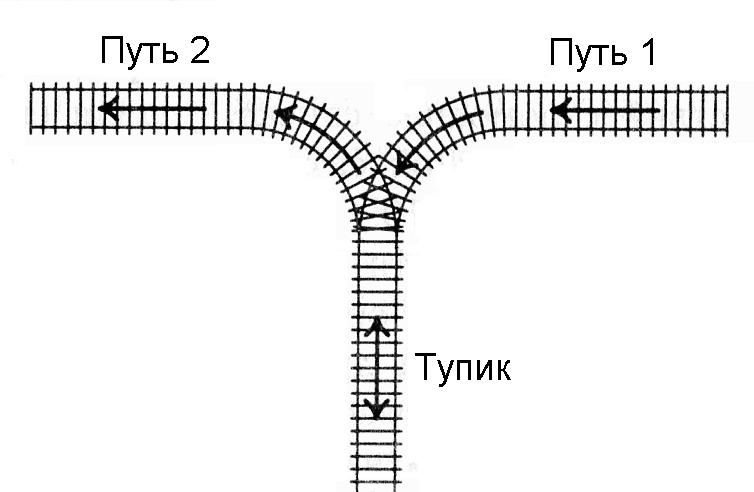

14. Сортировка вагонов lite
===========================

+---------------------+----------------------------------+
| Ограничение времени | 1 секунда                        |
+---------------------+----------------------------------+
| Ограничение памяти  | 64 Mb                            |
+---------------------+----------------------------------+
| Ввод                | стандартный ввод или input.txt   |
+---------------------+----------------------------------+
| Вывод               | стандартный вывод или output.txt |
+---------------------+----------------------------------+

К тупику со стороны пути 1 (см. рисунок) подъехал поезд. Разрешается отцепить от поезда один или сразу несколько первых вагонов и завезти их в тупик (при желании, можно даже завезти в тупик сразу весь поезд). После этого часть из этих вагонов вывезти в сторону пути 2. После этого можно завезти в тупик еще несколько вагонов и снова часть оказавшихся вагонов вывезти в сторону пути 2. И так далее (так, что каждый вагон может лишь один раз заехать с пути 1 в тупик, а затем один раз выехать из тупика на путь 2). Заезжать в тупик с пути 2 или выезжать из тупика на путь 1 запрещается. Нельзя с пути 1 попасть на путь 2, не заезжая в тупик.

Известно, в каком порядке изначально идут вагоны поезда. Требуется с помощью указанных операций сделать так, чтобы вагоны поезда шли по порядку (сначала первый, потом второй и т.д., считая от головы поезда, едущего по пути 2 в сторону от тупика). Напишите программу, определяющую, можно ли это сделать.

Формат ввода
------------

Вводится число N — количество вагонов в поезде (:math:`1 ≤ N ≤ 100`). Дальше идут номера вагонов в порядке от головы поезда, едущего по пути 1 в сторону тупика. Вагоны пронумерованы натуральными числами от 1 до N, каждое из которых встречается ровно один раз.

Формат вывода
-------------- 

Если сделать так, чтобы вагоны шли в порядке от 1 до N, считая от головы поезда, когда поезд поедет по пути 2 из тупика, можно, выведите сообщение YES, если это сделать нельзя, выведите NO.

Пример 1
--------

**Ввод**:

.. include:: in_1.txt
   :literal:

**Вывод**:

.. include:: out_1.txt
   :literal:

Пример 2
--------

**Ввод**:

.. include:: in_2.txt
   :literal:

**Вывод**:

.. include:: out_2.txt
   :literal:

Пример 3
--------

**Ввод**:

.. include:: in_3.txt
   :literal:

**Вывод**:

.. include:: out_3.txt
   :literal:

